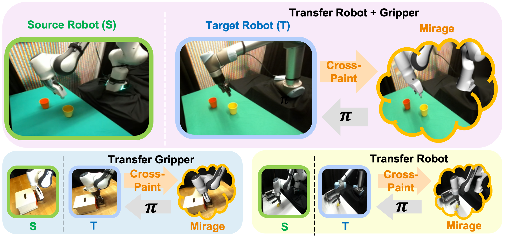

**Overview**
==================================

**Mirage** is a zero-shot cross-embodiment policy transfer method that uses cross-painting to bridge the visual 
gap and forward dynamics to bridge the control gap. The documentation provided here shows to run the cross-embodiment
benchmarks across different tasks, robots, grippers and simulation environments. The benchmarking code is modular to
provide the opportunity to extend and implement other methods.

.. autosummary::
   :toctree: _autosummary
   :template: custom-module-template.rst
   :recursive:

   mirage
